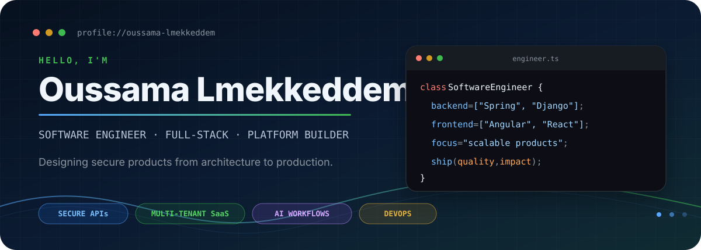
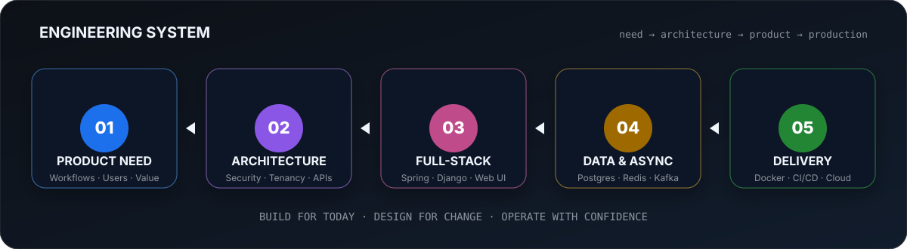
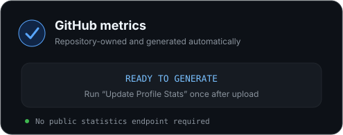
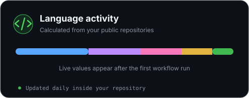

<p align="center">
  
</p>

<p align="center">
  <a href="https://www.linkedin.com/in/oussama-lmekkeddem-3b4606247/">LinkedIn</a>
  &nbsp;&bull;&nbsp;
  <a href="https://oussama-lmekkedddem.github.io/Portfolio">Portfolio</a>
  &nbsp;&bull;&nbsp;
  <a href="mailto:lmekkeddemoussama@gmail.com">Email</a>
  &nbsp;&bull;&nbsp;
  <a href="https://gitlab.com/Oussama-Lmekkedddem">GitLab</a>
</p>

<p align="center">
  <strong>I turn complex business workflows into secure, scalable, and useful software.</strong>
</p>

## `./whoami`

I am a **software engineer and full-stack product builder** working across backend architecture, modern web interfaces, enterprise integrations, and production delivery.

My strongest backend tools are **Java / Spring Boot** and **Python / Django**. On the frontend, I build with **Angular, React, and Next.js**. I especially enjoy systems that involve multi-tenant architecture, fine-grained permissions, asynchronous processing, AI-assisted workflows, and real operational constraints.

> [!NOTE]
> I care about more than making features work. I design systems that remain understandable, secure, and maintainable as they grow.

## `./engineering-system`

<p align="center">
  
</p>

## `./toolbox`

<p align="center">
  <kbd>Java</kbd>&nbsp;
  <kbd>Spring Boot</kbd>&nbsp;
  <kbd>Python</kbd>&nbsp;
  <kbd>Django</kbd>&nbsp;
  <kbd>REST APIs</kbd>&nbsp;
  <kbd>Spring Security</kbd>
</p>

<p align="center">
  <kbd>TypeScript</kbd>&nbsp;
  <kbd>Angular</kbd>&nbsp;
  <kbd>React</kbd>&nbsp;
  <kbd>Next.js</kbd>&nbsp;
  <kbd>HTML</kbd>&nbsp;
  <kbd>CSS / Sass</kbd>
</p>

<p align="center">
  <kbd>PostgreSQL</kbd>&nbsp;
  <kbd>MySQL</kbd>&nbsp;
  <kbd>Redis</kbd>&nbsp;
  <kbd>Celery</kbd>&nbsp;
  <kbd>Kafka</kbd>&nbsp;
  <kbd>Flyway</kbd>
</p>

<p align="center">
  <kbd>Docker</kbd>&nbsp;
  <kbd>Kubernetes</kbd>&nbsp;
  <kbd>Nginx</kbd>&nbsp;
  <kbd>Linux</kbd>&nbsp;
  <kbd>Azure</kbd>&nbsp;
  <kbd>GitLab CI/CD</kbd>&nbsp;
  <kbd>Jenkins</kbd>
</p>

## `./what-i-build`

<table>
  <tr>
    <td width="50%" valign="top">
      <h3>01 · Enterprise platforms</h3>
      Secure internal applications with business workflows, role-based access, identity integration, multilingual interfaces, and operational support.
      <br><br>
      <code>Spring Boot</code> <code>Angular</code> <code>OAuth 2.0</code> <code>Microsoft Graph</code>
    </td>
    <td width="50%" valign="top">
      <h3>02 · AI-assisted SaaS</h3>
      Multi-tenant products that combine intelligent workflows, background processing, external integrations, and permission-driven experiences.
      <br><br>
      <code>Django</code> <code>React</code> <code>Celery</code> <code>Redis</code> <code>PostgreSQL</code>
    </td>
  </tr>
  <tr>
    <td width="50%" valign="top">
      <h3>03 · Integration systems</h3>
      Reliable connections between applications, enterprise identity providers, email services, collaboration tools, and third-party platforms.
      <br><br>
      <code>REST</code> <code>JWT</code> <code>Azure AD</code> <code>Webhooks</code>
    </td>
    <td width="50%" valign="top">
      <h3>04 · Production delivery</h3>
      Containerized deployments, automated pipelines, reverse proxies, environment design, monitoring, and post-release investigation.
      <br><br>
      <code>Docker</code> <code>Nginx</code> <code>CI/CD</code> <code>Linux</code> <code>Cloud</code>
    </td>
  </tr>
</table>

## `./selected-work`

| System | Engineering focus | Stack |
| --- | --- | --- |
| **AI recruitment platform** | Multi-tenant architecture, intelligent workflows, background jobs, integrations, and granular access control | Django, React, PostgreSQL, Celery, Redis, Docker |
| **Enterprise learning platform** | Multi-role workflows, secure APIs, multilingual UI, Microsoft identity, and collaboration features | Spring Boot, Angular, MySQL, Azure AD, Microsoft Graph |
| **BaseApp platform** | Reusable foundation with authentication, permissions, messaging, internationalization, and containerized delivery | Spring Boot, React, Kafka, Docker, Kubernetes, Jenkins |
| **Financial management system** | Customer accounts, transactions, validation, authentication, and end-to-end business processes | Spring Boot, Thymeleaf, MySQL |

<p align="center">
  <a href="https://oussama-lmekkedddem.github.io/Portfolio"><strong>Explore my portfolio&nbsp; →</strong></a>
  &nbsp;&nbsp;&nbsp;
  <a href="https://github.com/Oussama-Lmekkedddem?tab=repositories"><strong>Browse my repositories&nbsp; →</strong></a>
</p>

## `./contribution-loop`

<p align="center">
  <picture>
    <source media="(prefers-color-scheme: dark)" srcset="https://raw.githubusercontent.com/Oussama-Lmekkedddem/Oussama-Lmekkedddem/output/pacman-contribution-graph-dark.svg">
    <source media="(prefers-color-scheme: light)" srcset="https://raw.githubusercontent.com/Oussama-Lmekkedddem/Oussama-Lmekkedddem/output/pacman-contribution-graph.svg">
    
  </picture>
</p>

## `./live-metrics`

<!-- These SVG files are generated inside this repository by GitHub Actions. -->
<p align="center">
  
  
</p>

<details>
  <summary><strong>How these statistics stay reliable</strong></summary>
  <br>
  The cards are generated once per day by the workflow included in this repository and saved as local SVG files. The README never calls a shared public statistics server when someone opens the profile.
</details>

## `./principles`

```yaml
engineering:
  architecture: "modular and designed for change"
  security: "part of the design, not a final patch"
  delivery: "automated, observable, and repeatable"
  product: "useful to people, maintainable by teams"
  mindset: "understand deeply, build simply, improve continuously"
```

## `./connect`

I am always interested in meaningful software projects, architecture discussions, and opportunities to build products with real impact.

<p align="center">
  <a href="mailto:lmekkeddemoussama@gmail.com"><strong>Start a conversation</strong></a>
  &nbsp;&bull;&nbsp;
  <a href="https://www.linkedin.com/in/oussama-lmekkeddem-3b4606247/"><strong>Connect on LinkedIn</strong></a>
</p>

<p align="center">
  
</p>
